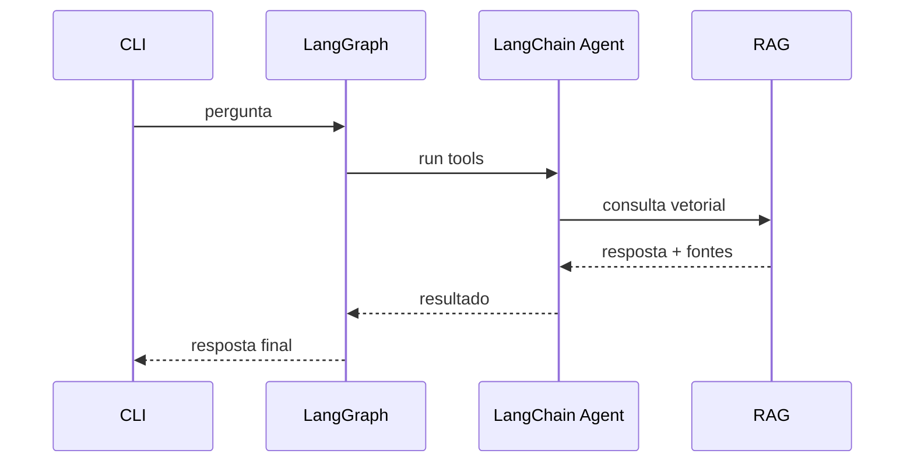
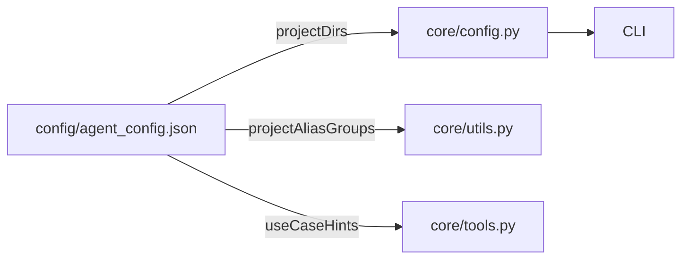

# Arquitetura do Agente RAG Certidão Imobiliária

Este documento descreve como o agente agrege LangChain, LangGraph, RAG e as ferramentas próprias para operar sobre os repositórios da migração.

## 1. Visão geral (fluxo de execução)

```mermaid
flowchart TD
    A[Usuário] -->|pergunta| B[CLI / API FastAPI]
    B --> C[LangGraph Execution (Estado)]
    C --> D[LangChain Agent + RAG]
    D --> E[Tools: docs / arquivos / downloads]
    E --> F[Repositórios + docs/]
    F --> G[Resposta]
    G --> C --> B --> A
```

- O **CLI principal (`core/cli.py`)** (ou o servidor FastAPI) lê perguntas do terminal/HTTP.
- O **grafo LangGraph (`core/rag_agent.py`)** orquestra a execução do `build_lc_agent`, atualizando o histórico `rag_history`.
- A **cadeia RAG (`build_rag_chain`)** consulta a base vetorial em `.rag_db` (criada por `ingest.py`) e sintetiza a resposta via `LegacyChatOpenAI`.
- As **tools (`core/tools.py`)** expõem leitura/gravação de arquivos e buscas em projetos configurados, reutilizando os aliases definidos no arquivo `config/agent_config.json`.
- Todos os acessos e registros são auditados pela camada de utilitários (`core/utils.py`) que gera `docs/todo.md`, `docs/arquivos_alterados.md` e relatórios sob `docs/execucoes/`.

## 2. Tecnologias principais

### 2.1 LangChain + LangGraph



- **LangChain Agent** (modo `OPENAI_FUNCTIONS`) coordena o `LegacyChatOpenAI` com tools (`consultar_documentacao`, `buscar_arquivos`, etc.).
- **LangGraph** mantém o estado (`AgentState`), adicionando callbacks para logging (`TerminalCallbackHandler`).
- **RAG** usa `Chroma` + `OpenAIEmbeddings`, apontando para `.rag_db` gerada por `ingest.py`.

### 2.2 Configuração e aliases



- `config/agent_config.json` contém os caminhos, frameworks e aliases para os quatro ambientes (`frontend_legado`, `frontend_atual`, `backend_atual`, `backend_legado`).
- O `.env` agora define apenas variáveis sensíveis (`OPENAI_API_KEY`, modelos, limites e `AGENT_CONFIG_PATH`).
- As ferramentas e utilitários são carregados via package `core.*`, mantendo `agent.py` leve.

## 3. Subsistemas e papéis

| Camada      | Responsabilidade                                                                | Arquivos chave                               |
| ----------- | ------------------------------------------------------------------------------- | -------------------------------------------- |
| Config      | Carrega `.env` + JSON, expõe paths e constantes                                 | `core/config.py`, `config/agent_config.json` |
| Ferramentas | Busca arquivos, lê/grava conteúdo, normaliza aliases                            | `core/tools.py`, `core/utils.py`             |
| RAG+Agent   | Cria cadeia ConversationalRetrievalChain, LangChain agent com tools e LangGraph | `core/rag_agent.py`                          |
| CLI/API     | Loop principal e servidor FastAPI                                               | `core/cli.py`, `agent.py`, `server.py`       |

## 4. Diagramas secundários

- **Ingestão**: `ingest.py` lê `docs/`, divide em chunks (`RecursiveCharacterTextSplitter`) e persiste em `.rag_db` via Chroma.
- **Documentação viva**: cada execução atualiza `docs/todo.md`, `docs/arquivos_alterados.md` e cria um markdown em `docs/execucoes/` com `utils.registrar_*`.

## 5. Próximos passos sugeridos

1. Criar testes automáticos que simulem ferramentas (`tools.buscar_arquivos`, `core/cli.run`).
2. Adicionar monitoramento para `AGENT_CONFIG_PATH` ausente para evitar comportamento silencioso.
3. Gerar visualizações adicionais (ex.: ER de documentos indexados) com Mermaid em novas seções deste documento.
